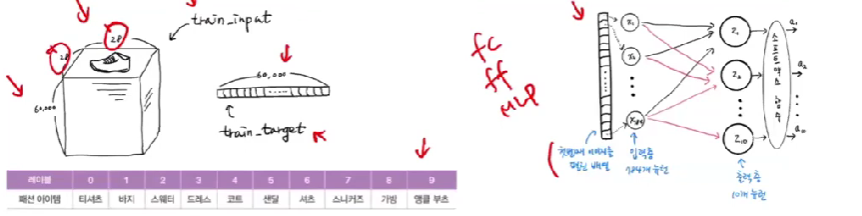
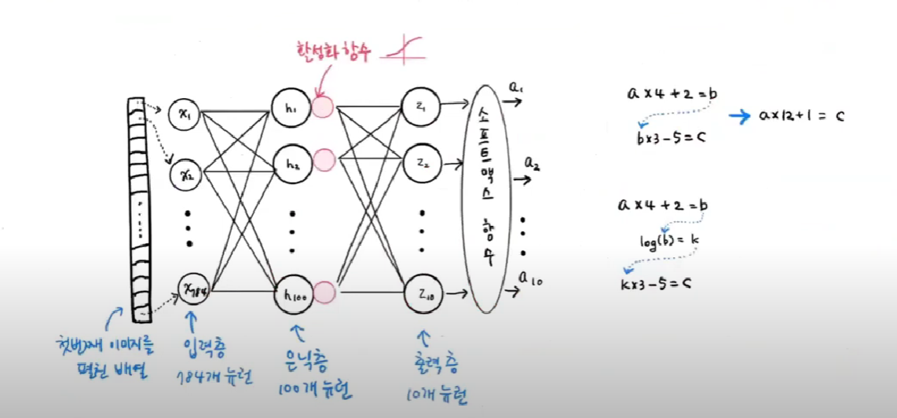
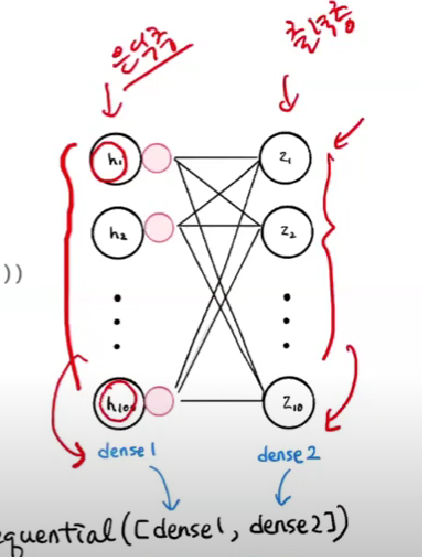

# [혼자 공부하는 머신러닝+딥러닝] 18강. 심층 신경망 ▶️인공 신경망에 층을 추가하여 심층 신경망 만들어 보기

- 신경망 모델의 특징
    => 층을 추가한다!
- 앙상블 모델과 다른 점?
    - 신경망 모델은 은닉층에 있는 여러 개의 뉴런이 동시에 훈련 (앙상블 모델ex.랜덤포레스트는 개별 트리가 독립적으로 훈련됨)
    - random forest의 경우에는 층을 여러 개 쌓을 수 x, 신경망 모델은 여러개의 층 쌓을 수 ㅇㅇ 
    - gradient boosting의 경우는 층을 쌓아서 순차적으로 훈련, 신경망 모델의 경우에는 층들이 동시에 훈련 ㅇㅇ
    - `전통적인 ml 모델`들은 엑셀이나 db같은 `정형화된` 데이터에 잘맞음. `신경망`의 경우는 텍스트, 이미지와 같은 `비정형` 데이터에 잘맞음 (각 층들이 이미지/텍스트의 특징들을 다음 층으로 전달해주는 역할을 함)
---



- tensorflow가 keras 모델 정의하고 층을 구성성
    - compile 메소드 호출 => 손실함수 등 정의
    - evaluate 구조로 모델 평가 


- 2개의 층
    - 입력층은 입력 데이터 그 자체
    - 2개의 층 : `은닉층`, `출력층` 
    - 28x28 이미지 이므로 784개 뉴런 입력층
    - 다중 분류이기 때문에 softmax 사용, 이진 분류면 sigmoid 
    - 은닉층에 많이 사용되는 `활성화 함수` : sigmoid, relu, 등

```py
dense1 = keras.layers.Dense(100, activation='sigmoid', input_shape=(784,))
dense2 = keras.layers.Dense(10, activation='softmax')

model = keras.Sequential([dense1, dens2])
```

- param 값이 내가 생각한 구조와 맞아 떨어지면 내가 구성한 대로 잘 동작하는 모델인 것
- output shape 'none' 부분 -> 확률적 경사 하강법 batchsize

#### 층을 추가하는 다른 방법
```py
model = keras.Sequential()
model.add(keras.layers.Dense(100, activation='sigmoid', input_shape=(784,)))
model.add(keras.layers.Dense(10, activation='softmax'))
```
(실제로 많이 쓰는 방법)

#### 모델 훈련
```py
model.comfile(loss='sparse_categorical_crossentropy, 
metrics='accuracy')

model.fit(train_scaled, train_target, epochs=5)
```
- epoch 반복 횟수

## 렐루 함수와 flatten 층

- relu 활성화 함수
    - sigmoid 함수는 선형 값이 너무 크거나 작으면 층이 잘 안나눠지는 문제가 있음
    - max함수: 선형출력값(z값)이 0보다 크면 z를 출력하고 0보다 작으면 0으로 버려버리는 단순한 함수
- flatten 층
    - 28x28 이미지를 784개의 1차원 배열로 풀어서 전달하는 입력 작업에서, 그 1차원으로 펼치는 작업을 flatten 층이 해주는 것

## 옵티마이저

- 기본적으로 `확률적 경사 하강법` 알고리즘 사용
    => 실제로는 미니 배치 경사 하강법 ? (하나하나 다 해볼 수 x)
- 여러 가지 옵티마이저들을 실험해보고 가장 잘 맞는
옵티마이저를 선택하고 검정하는 과정 필요
- `compile()`에서 optimizer=로 지정
- 종류: **SGD, RMSprop, Adam** 등
- learning rate(학습률) 같은 하이퍼파라미터도 조절 가능
